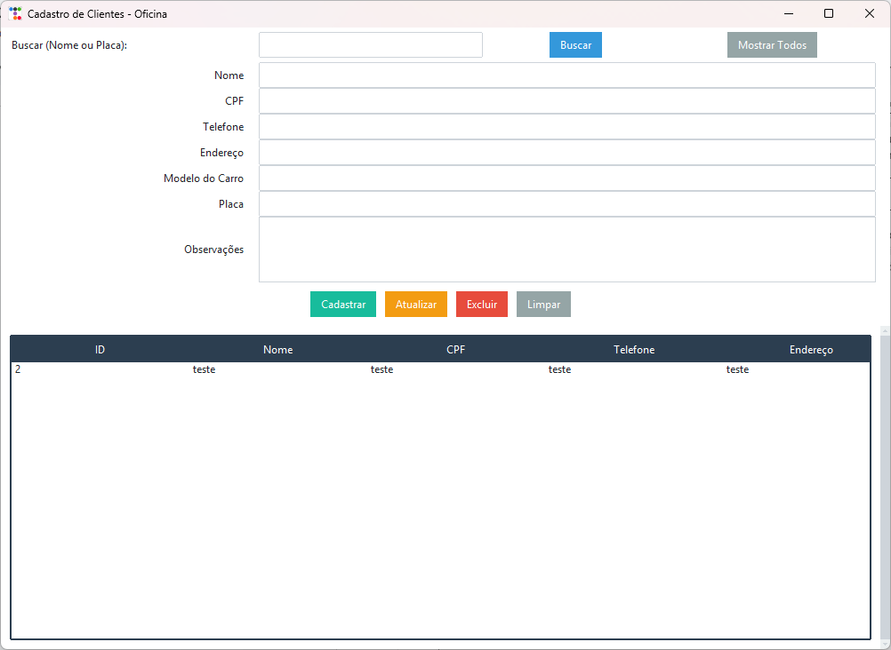

# Sistema de Cadastro de Clientes - Oficina VP Lanternagem

Este repositório contém o código fonte e o executável de um sistema de cadastro de clientes desenvolvido para a oficina **VP Lanternagem**. O sistema foi criado como parte do projeto de extensão no curso de Engenharia de Software, com o objetivo de digitalizar e melhorar o processo de gerenciamento de clientes e orçamentos da oficina.

## Descrição do Projeto

O sistema desenvolvido permite que os funcionários da oficina registrem, consultem, atualizem e excluam informações sobre os clientes e seus respectivos orçamentos. A aplicação foi construída utilizando a linguagem Python, banco de dados SQLite e uma interface gráfica moderna com a biblioteca **ttkbootstrap**, uma extensão do Tkinter.

O sistema foi empacotado em um executável (.exe), permitindo que a aplicação seja executada diretamente em máquinas Windows, sem a necessidade de instalação do Python ou outras dependências.

## Funcionalidades

- **Cadastro de clientes:** Permite registrar nome, CPF e endereço dos clientes.
- **Cadastro de orçamentos:** Permite registrar o modelo do carro, placa, descrição do serviço e o valor do orçamento.
- **Busca de clientes:** Permite realizar a busca de clientes pelo nome ou CPF.
- **Edição e exclusão de registros:** Permite editar ou excluir os registros dos clientes e orçamentos cadastrados.
- **Backup:** O banco de dados é armazenado localmente, permitindo cópias regulares do arquivo `.db`.

## Requisitos

- **Sistema Operacional:** Windows 7 ou superior
- **Requisitos Adicionais:** Não necessita de internet para funcionamento
- **Arquivo Executável:** `sistem.exe`

## Como Usar

1. **Abrir o sistema:** Clique duas vezes no arquivo `sistem.exe`.
2. **Cadastrar Cliente:** Preencha os campos de nome, CPF e endereço, e clique em **Salvar**.
3. **Cadastrar Orçamento:** Informe modelo do carro, placa, descrição e valor, e clique em **Salvar Orçamento**.
4. **Buscar Cliente:** Digite o nome ou CPF do cliente e clique em **Buscar**.
5. **Editar/Excluir:** Após localizar um cliente ou orçamento, altere os dados e clique em **Atualizar** ou **Excluir**.

## Backup do Banco de Dados

O banco de dados é armazenado localmente no arquivo `.db`. Faça cópias regulares desse arquivo para garantir a segurança dos dados.

## Link para o Código

O código fonte completo do projeto está disponível no [GitHub](https://github.com/LizVirna/sistema-oficina2).

## Print da Interface Gráfica

## Conclusão

O sistema contribui significativamente para a melhoria do gerenciamento dos clientes e orçamentos da oficina VP Lanternagem, substituindo o processo manual e aumentando a agilidade e eficiência nas operações diárias.
